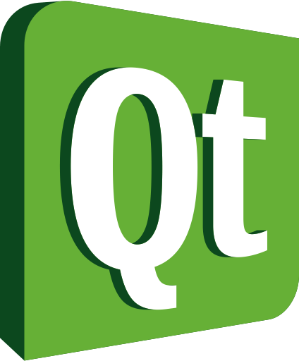

# GeekBrains - Курс:
## Мобильная разработка на С++/QtQUICK

-------------------------------
> [Домашняя работа № 01](Homework_01) 
> [Домашняя работа № 02](Homework_02) 
> [Домашняя работа № 03](Homework_02) 
> [Домашняя работа № 04](Homework_04) 
> [Домашняя работа № 05](Homework_05) 

-------------------------------

